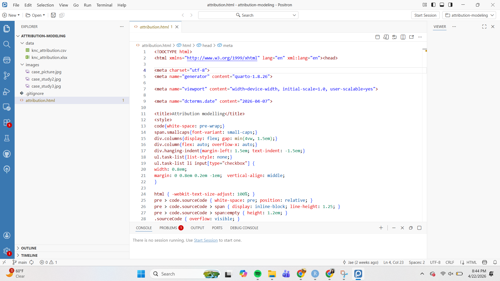
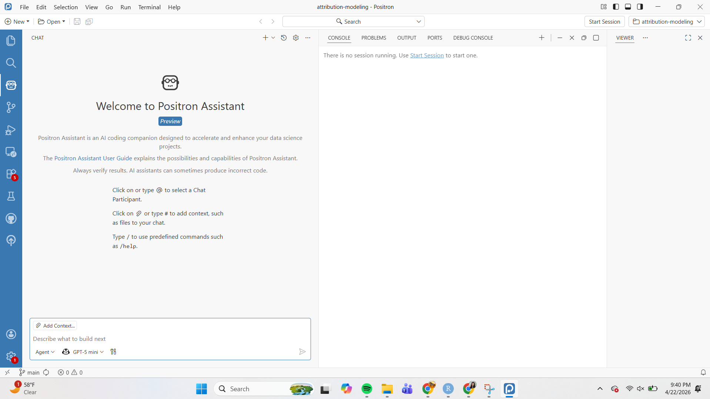

## Essay Prompt 1

> Download and Install Positron. As you watch the videos in Step 1 and Step 3, follow the activities in the video and be familiar with Positron.

Positron has been installed to computer after watching Step 1 & Step 3.

{width="394"}

## Essay Prompt 2

> Based on what you learned from Step 1 and Step 3, what do you like about Positron compared with RStudio?

Based on what I learned from Step 1 & Step 3 from this module, Positron and RStudio have a lot of similarities and challenging differences. We have been using RStudio for over 3/4 of the 2 year program so it has become a easy to use program even if at the beginning the IDE was something that seemed impossible to use. I have used Visual Code before and the Positron IDE has the same layout making it easier for me to use. Positron does have simpler layout to use and has an AI tool called Copilot that acts like an assist tool.

## Essay Prompt 3

> In Step 4, the video demonstrates how you can use AI. 

### AI in Positron

> Describe the various ways you can use AI inside Positron. Some are free while others are not. 

AI is integrated inside of Positron's IDE and it can be used in several ways. Positron itself is free however during the lecture we saw that Copilot was not free, we had to sign up for it to try to get it free using an education student account. AI can be used to debug errors, generate code, and also chat about questions regarding the code. AI can help explore different data sets and suggest different transformations and visualizations.

### AI Tools

> Which AI tools have you installed or set up? Which AI tools did you find beneficial for you?

So far there are only some AI tools I use in general. This includes ChatGPT and Claude for search questions regarding anything in my daily life. I find ChatGPT beneficial since the school provides a free version using our .edu email. Having this resources has helped has me progress in understanding lectures providing study material and analyzing code and results.

### Github Copilot

> I strongly recommend using GitHub Copilot, which is free if you apply for an education account.

#### Screenshot

> Apply for it and take a screenshot showing you were accepted into the education program. 

I already had CoPilot installed from before so here is screenshot of Copilot being able to be used.



#### Elaborate

> Play with it and do you find it helpful or distracting? Please elaborate

I enjoy using CoPilot Positron Assistant. Having it as an extra tool to explain executed code or certain error it helps the coding process faster. It is a big help with catching error especially really small syntax error giving in the code.

### Essay Prompt 4

``` important
Publish this report to GitHub Pages and provide a URL to the GitHub Pages for the report. Note that although both GitHub Pages and GitHub repo are online, they are different. GitHub Pages is a website publishing service that hosts the rendered HTML from a QMD file.
```

Link to GitPages:
